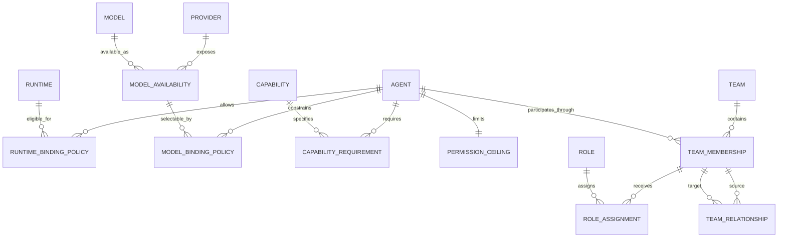

# Agent Domain Model

- **Status:** Proposed
- **Owner:** Staff Architect
- **Created:** 2026-08-16
- **Last updated:** 2026-08-16
- **Generated by:** Codex, acting as Staff Architect
- **Command:** COD-004 Agent Domain Model Design
- **Approvers:** Architecture owner and repository maintainer
- **Related:** [Agent OS blueprint](../agent-os-blueprint.md), [current-state architecture](./current-state.md), [Agent Runtime boundary](./agent-runtime-boundary.md), [ADR-001](../architecture-decisions/ADR-001-agent-runtime-boundary.md), [ADR-002](../architecture-decisions/ADR-002-agent-domain-composition.md)

## Purpose

This document defines the conceptual domain model for the Agent Organization
Layer of CC Switch Agent OS. It establishes stable identity and relationship rules
for Agent, Runtime, Provider, Model, Role, Capability, Permission, Team, and Team
Membership without selecting persistence, serialization, programming-language, or
user-interface representations.

The model extends the Agent Runtime boundary. It tells orchestration **who** may
participate, **what responsibility** is assigned, and **which constraints** must
be resolved before the runtime boundary is asked to execute. It does not redefine
how a runtime performs an execution.

## Evidence and design context

The model is based on the following verified inputs at the COD-004 baseline,
GitHub `LoftySeas/cc-switch` `main` commit
`2b98894f730ad043414aaf4b0968edcd83a5fba7`:

- the Agent OS blueprint requires runtime-first evolution, Role/Model separation,
  explicit workflows, cost awareness, and human control;
- `CONTEXT.md` identifies the Agent domain model as the next architecture
  foundation after the runtime boundary;
- the current-state audit finds no first-class Agent, Role, Team, Workflow,
  Permission, or Execution domain and warns against extending `Provider` or
  `AppType` into those concepts;
- the Agent Runtime boundary and ADR-001 establish independent identities for
  Agent, Runtime, Provider, Model, and Role, plus capability negotiation and
  deny-by-default execution grants; and
- existing CC Switch provider, configuration, proxy, session, and usage services
  remain compatibility boundaries rather than Agent Organization entities.

Detailed source and validation evidence is recorded in the
[COD-004 evidence report](../reviews/cod-004-agent-domain-model-evidence.md).

## Scope

This document defines:

- stable Agent identity and lifecycle;
- runtime eligibility and per-execution runtime binding;
- Provider and Model identity separation;
- contextual Role definition and assignment;
- Capability definition, requirement, and effective resolution;
- Permission policy, ceiling, request, and grant boundaries;
- Team identity, Team Membership, Role Assignment, and relationship edges;
- invariants and lifecycle rules across these concepts; and
- extension seams for Team Graph, Workflow Engine, Context Management, and MVP
  planning.

This document does not define:

- database tables, keys, indexes, migrations, or storage ownership;
- Rust types, traits, Tauri commands, React state, forms, or routes;
- JSON, YAML, IPC, or event serialization;
- a fixed catalog of roles, capabilities, or permission actions;
- workflow state machines, scheduling, prompt construction, or memory retention;
- adapter hosting, sandboxing, secret storage, or remote execution technology; or
- migration of existing Provider, `AppType`, `AppId`, session, proxy, or usage
  records.

## Foundational invariants

The primary invariant is:

```text
Agent != Role != Model != Runtime != Provider
```

The following rules make that invariant operational:

1. An Agent has one stable identity across role assignments and eligible
   execution bindings.
2. A Role describes bounded responsibility; it is not an Agent subtype and does
   not imply a Runtime, Provider, Model, Capability, or Permission.
3. A Runtime describes how execution occurs; it does not determine organizational
   identity or responsibility.
4. A Provider identifies an approved service endpoint, account, or credential
   context. It is not an Agent or Model.
5. A Model identifies inference behavior available through an eligible Provider
   or local Runtime. It is not an Agent, Role, or Permission principal.
6. Capability describes evidenced ability. Permission describes allowed
   authority. Neither implies the other.
7. Team Membership states that an Agent participates in a Team. It does not by
   itself assign a Role or grant execution authority.
8. Every execution records immutable snapshots or references for the Agent,
   Runtime, Provider, Model, Role Assignment, effective Capabilities, and
   Permission Grant actually used.

## Conceptual model



This diagram expresses domain relationships, not database cardinalities. For
example, a policy may be embedded or referenced in a future implementation; the
model only requires its semantics and identity boundaries to remain visible.

## Domain concepts

### Agent

An **Agent** is the stable, user-visible identity of an AI team participant. It is
the principal to which ownership, policy, membership, and execution history are
attributed.

An Agent conceptually carries:

- a stable Agent ID that is never borrowed from a runtime, provider, model, role,
  team, or native session;
- human-facing name and description;
- owner and lifecycle state;
- runtime eligibility policy;
- provider/model selection policy;
- required and optional Capability requirements;
- a Permission ceiling;
- default cost and operational policy; and
- references to context policy, without embedding retained context.

The term **Agent Profile** refers to the configurable aggregate view of this Agent
and its policies. It does not introduce a second identity. An interface may call
the aggregate an Agent Profile, but team membership and execution history refer to
the stable Agent ID.

#### Agent lifecycle

An Agent may be `Draft`, `Active`, `Suspended`, or `Retired`:

- `Draft` may be configured but cannot be selected for productive execution.
- `Active` may participate when every contextual requirement resolves.
- `Suspended` retains identity, memberships, and history but is ineligible for new
  execution.
- `Retired` is immutable historical identity and cannot receive new assignments.

Deletion must not erase execution, review, or Team history. A future retention
decision may define physical removal only when no governed references remain.

Changing display name, Runtime preference, Provider, Model, Role Assignment,
Capability requirement, or Permission ceiling does not create a new Agent.
Historical executions retain the effective values used at their acceptance time.

### Runtime

A **Runtime** is an executable agent environment addressed through the
`AgentRuntime` boundary, such as a discovered Codex CLI or Claude Code
installation. Runtime identity and adapter identity remain defined by ADR-001.

An Agent does not own a Runtime and a Runtime does not own an Agent. The
relationship is an eligibility policy:

- one Agent may allow multiple Runtimes for portability or fallback;
- one Runtime may serve multiple Agents with different policies and histories;
- runtime eligibility may require a type, installation, endpoint, version, or
  evidenced Capability constraint; and
- one execution resolves exactly one Runtime binding before productive work.

The resolved Runtime binding is immutable for one execution attempt. Switching
Runtime creates a new execution attempt unless the runtime contract explicitly
supports a compatible handoff and the workflow records it.

Runtime adapters receive role context and the effective Permission Grant, but
must not assign roles, add memberships, select team relationships, or broaden
Agent policy.

### Provider

A **Provider** identifies an approved model-service endpoint, local inference
service, account, or credential context. Existing CC Switch Provider records
remain the compatibility source for current provider management until a separate
migration decision is accepted.

Provider identity answers **where and under which approved account** inference is
obtained. It does not answer who the Agent is, which responsibility it holds, or
which Model is selected.

Provider bindings are policy-controlled references. Credentials are never copied
into Agent, Role, Team, or Membership data. A binding resolves an opaque
credential reference only at an authorized execution boundary.

### Model

A **Model** is a catalog identity for inference behavior, version, and relevant
planning metadata. A Model is exposed in a context: through a Provider, by a local
Runtime, or through another future availability source.

Provider and Model remain separate because:

- one Provider may expose many Models;
- one Model family may be exposed by multiple Providers under different catalog
  identifiers, prices, quotas, or capabilities;
- Provider availability or credentials may change without changing Agent
  identity; and
- Model selection may change per task without changing Agent, Role, or Team
  Membership.

**Model Availability** represents the evidence that a Model can currently be used
through a Provider or local Runtime, including its source, freshness, limits, and
uncertainty. **Model Binding Policy** states which availabilities an Agent or
workflow may select. One execution resolves exactly one effective Model binding
when inference is required and records the Provider context, if any.

Provider/model selection must satisfy runtime compatibility, Agent policy,
workflow constraints, Permission, budget, and current availability. A Role name
must never act as a hidden routing key to a particular Model.

### Role

A **Role** is a reusable responsibility contract, such as Architect, Developer,
Reviewer, QA Engineer, or Researcher. It describes expected outcomes and
responsibility semantics rather than an implementation persona.

A Role may define or reference:

- responsibility and decision scope;
- expected inputs, outputs, and evidence;
- required Capability expressions;
- recommended Permission requests and approval gates;
- context-view requirements;
- separation-of-duty constraints; and
- compatibility metadata for evolving the Role definition.

A Role does not contain Agent, Runtime, Provider, or Model identity. Its Permission
content is a requested baseline or constraint, never a grant. Its Capability
content is a requirement, never proof that an Agent can satisfy it.

Roles are assigned contextually through **Role Assignment**. One Agent can hold
different Roles in different Teams, workflows, or tasks. Multiple Agents may hold
the same Role. A Role Assignment is bounded by scope and time and must retain the
Role definition version used for governed execution.

### Capability

A **Capability** is a versioned, namespaced statement of behavior that may be
required or evidenced. It is not a boolean field on Agent and is not Permission.

The model distinguishes:

- **Capability Definition:** stable semantic name, version rules, and constraint
  vocabulary;
- **Capability Requirement:** required or optional behavior plus minimum version,
  limits, and acceptable fallback;
- **Capability Evidence:** source, observed support state, constraints, timestamp,
  and confidence for a Runtime, Model availability, tool, or other provider of
  behavior; and
- **Effective Capability Set:** the supported intersection resolved for one
  execution context.

Capability evidence may come from runtime probes, adapter descriptors, Provider
or Model catalogs, tool registration, or validated configuration. Static Agent
configuration can require or allow Capabilities, but cannot assert that they are
currently present.

Effective resolution must combine all applicable requirements from Agent, Role,
Team, workflow step, and task. A missing required Capability prevents assignment
or execution preparation. Optional behavior may be omitted only when its owner
declares an acceptable fallback.

Capability Definition evolves additively when possible. A semantic change uses a
new version; unknown required semantics fail closed.

### Permission

**Permission** represents authorized actions and resource bounds. It is evaluated
independently from Capability and Role.

The Permission model has four distinct stages:

1. **Permission Policy** describes reusable allow, deny, constraint, and approval
   rules owned by a human or governing scope.
2. **Permission Ceiling** is the maximum authority an Agent may ever receive.
3. **Permission Request** states the bounded authority required by a workflow step
   or task under an assigned Role.
4. **Permission Grant** is the immutable, auditable authority approved for one
   execution attempt.

The effective grant is no broader than the intersection of:

- repository and human-owner policy;
- Team policy;
- workflow and task policy;
- the Agent Permission ceiling;
- Role Assignment constraints;
- workspace and environment policy;
- Runtime enforcement Capability; and
- explicit approvals for gated side effects.

An allow at one layer does not override a deny or tighter bound at another layer.
Unsupported enforcement fails preparation. Capability to write files does not
grant write Permission; write Permission does not prove the Runtime can enforce
or perform it.

Team Membership, Role labels, cost class, Provider credentials, prior execution,
or model output must never be interpreted as a Permission Grant.

### Team

A **Team** is a stable, human-owned collaboration boundary that groups Agents for
a declared purpose. It is a configuration and policy context, not a running
workflow and not a conversation.

A Team conceptually contains:

- stable Team identity, name, purpose, owner, and lifecycle;
- Team-level policy and default constraints;
- Team Memberships;
- scoped Role Assignments;
- optional directed Team Relationships; and
- references to compatible workflow definitions and context policy.

A Team may be `Draft`, `Active`, `Suspended`, or `Archived`. Archiving preserves
membership and assignment history. A Team cannot execute work merely because it
is Active; a workflow or explicit task must create bounded execution intent.

### Team Membership

**Team Membership** is the explicit association between one Agent and one Team.
It has its own identity and lifecycle because membership history is not Agent
identity and may be referenced by assignments, relationships, workflows, and
reviews.

A Membership conceptually records:

- Team and Agent references;
- membership state and validity interval;
- optional human-readable label;
- policy refinements that can only narrow Team and Agent policy; and
- provenance showing who or what authorized the membership change.

Membership may be `Invited`, `Active`, `Suspended`, or `Ended`. Ending membership
prevents new assignments and executions in that Team but preserves prior Role
Assignments, relationships, and execution references.

Membership alone does not assign a Role, define hierarchy, satisfy a Capability,
or grant Permission.

### Role Assignment

**Role Assignment** links a Role to a Team Membership for a bounded scope. Scope
may later represent a Team default, workflow, workflow step, task, or review gate;
the storage and serialization shape is deferred.

An assignment records:

- Membership and Role references;
- scope and validity;
- Role definition version;
- Capability requirements and Permission constraints that narrow the referenced
  definitions; and
- provenance and lifecycle state.

Assignment is eligibility, not execution. Before each workflow step, orchestration
must verify active Membership, assignment scope, Agent state, effective
Capabilities, separation-of-duty constraints, budget, and Permission.

### Team Relationship

A **Team Relationship** is an optional, directed, typed edge between two active or
historical Memberships in the same Team. Examples include `manages`, `reviews`,
`consults`, or `hands-off-to`.

Relationship types describe collaboration semantics. They must not imply
Permission, process ownership, or workflow transitions unless an explicit
workflow policy interprets the edge. Unknown relationship types can be retained
as extension data but cannot silently gain control semantics.

The Team Graph is a projection of Team, Membership, Role Assignment, and Team
Relationship records. It is not a separate source of identity.

## Relationship rules and cardinality

| Relationship | Rule |
| --- | --- |
| Agent to Runtime | Many-to-many eligibility; exactly one resolved Runtime per execution attempt |
| Agent to Provider | Many-to-many policy eligibility; zero or one resolved Provider context per model-bound execution |
| Provider to Model | One-to-many or many-to-many availability depending on catalog semantics; represented explicitly as Model Availability |
| Agent to Role | Many-to-many through scoped Role Assignment; never a permanent type discriminator |
| Agent to Capability | Requirements belong to policy; evidence belongs to current bindings; effective set is execution-scoped |
| Agent to Permission | One effective ceiling composed from policies; one immutable effective Grant per execution |
| Team to Agent | Many-to-many through Team Membership |
| Membership to Role | Zero-to-many scoped Role Assignments |
| Membership to Membership | Zero-to-many directed Team Relationships inside one Team |

No foreign identifier may substitute for another concept's ID. User-facing names
are mutable labels, not identifiers.

## Resolution before execution

The domain model does not execute work. It produces a validated candidate for the
Agent Runtime boundary.

```mermaid
flowchart LR
    Intent["Workflow step or bounded task"]
    Assignment["Resolve Team Membership and Role Assignment"]
    AgentPolicy["Resolve Agent eligibility and policy"]
    Binding["Resolve Runtime, Provider, and Model binding"]
    Capability["Resolve effective Capabilities"]
    Permission["Evaluate Permission request and approvals"]
    Request["Create immutable execution request and Grant"]
    Runtime["AgentRuntime prepare/start"]

    Intent --> Assignment --> AgentPolicy --> Binding --> Capability --> Permission --> Request --> Runtime
```



Resolution rules:

1. The workflow or task declares responsibility, acceptance criteria, and
   required Capabilities; it does not select by display-name coincidence.
2. An active Role Assignment identifies eligible Memberships and Agents.
3. Agent, Team, and assignment policies narrow the eligible binding set.
4. Current Runtime, Provider, Model, and tool evidence proves which candidates can
   satisfy requirements.
5. Permission evaluation produces an explicit Grant or a denial/approval request.
6. The execution request records immutable resolved references and evidence.
7. The Agent Runtime adapter receives the request but cannot revisit team or role
   selection.

Failure at any step is explicit. Orchestration may select another eligible Agent
or binding only when workflow policy permits it and records the decision.

## Aggregate and ownership boundaries

These are logical consistency boundaries, not persistence instructions:

- **Agent aggregate:** Agent identity, lifecycle, eligibility policy, Capability
  requirements, and Permission ceiling. It does not own Runtime, Provider, Model,
  Role, Team, or execution history.
- **Runtime catalog:** Runtime descriptors, installations/endpoints, adapter
  versions, and Capability evidence. It does not own Agents or organizational
  assignments.
- **Provider/model catalog:** existing Provider references, Model identities, and
  availability evidence. It does not own Agent or Role identity.
- **Role catalog:** reusable Role definitions and versions. It does not own
  assignments or grants.
- **Team aggregate:** Team policy, Memberships, Role Assignments, and Team
  Relationships. It references Agents and Roles rather than copying them.
- **Execution record:** immutable resolved bindings, effective Capabilities,
  Permission Grant, events, outcome, and evidence. Its lifecycle is defined by
  the runtime and future workflow contracts.

Cross-boundary changes use explicit commands or future domain events and retain
provenance. No aggregate silently updates another aggregate's identity.

## Cost and routing boundaries

Cost policy is orthogonal to Role and identity:

- an Agent may carry default budget and relative cost preferences;
- Provider/Model Availability may carry price, quota, latency, and confidence
  evidence;
- a workflow step may declare a budget and quality constraint;
- routing selects only from candidates that already satisfy Capability and
  Permission requirements; and
- an expensive Model is never selected solely because a Role is named Architect
  or Reviewer.

Historical execution stores observed usage and cost evidence separately from the
planning estimates used to select a binding.

## Extension strategy

### Team Graph

Team Graph consumers read stable Agent and Team IDs, Memberships, scoped Role
Assignments, and typed Relationship edges. New Role or Relationship kinds are
catalog additions, not new Agent subclasses. Graph visualization must not become
the authority for Permission or workflow state.

### Workflow Engine

The Workflow Engine will reference Role requirements and select eligible
Memberships or Agents. Each step creates a bounded Permission Request and an
immutable execution binding. Workflow state, retries, approvals, checkpoints, and
handoffs remain separate from Agent and Team lifecycle.

### Context Management

Context policy may be referenced by Agent, Role, Team, workflow, and task. The
Context Manager resolves the least-privilege view for one execution. Context
content, memory, retention, and secret handling are not embedded in the Agent or
Membership record.

### Capability and permission catalogs

Definitions are namespaced and versioned. New runtime adapters, tools, model
families, and external integrations add evidence and actions without changing the
identity model. Unknown required semantics fail closed; unknown optional metadata
may be preserved safely.

### Organizational scale

Future organization, tenant, marketplace, and remote-execution scopes may add
ownership and policy layers. They must narrow or compose with existing identity
and Permission boundaries rather than redefining Agent as a Model or credential.

## Compatibility and migration posture

The domain model is additive:

- existing Providers remain provider records and are referenced, not migrated
  into Agents;
- current `AppType` and frontend `AppId` remain runtime/client compatibility
  classifications until runtime adapters replace their responsibilities;
- existing model catalogs, proxy routing, native configuration, sessions, usage,
  profiles, and IPC continue unchanged;
- no current provider switch creates or mutates Team Membership;
- no existing runtime session is assumed to be an Agent OS execution; and
- Agent OS records must initially coexist with current behavior behind separately
  approved milestones.

The first MVP slice should prove configuration and read-only resolution before
launching or mutating external runtimes. Product sequencing requires a separate
milestone decision.

## Alternatives considered

### One mutable Agent Profile containing every concern

This would embed runtime, Provider credentials, Model, Role, Capabilities,
Permissions, and Team fields in one record. It is initially easy to render but
makes identity change whenever a binding or assignment changes, encourages secret
duplication, and prevents reliable audit history. Rejected.

### Role-specific Agent types

This would define ArchitectAgent, DeveloperAgent, or ReviewerAgent subtypes. It
would encode organizational responsibility into identity and duplicate Agents
when one participant serves multiple Roles. Rejected.

### Provider or Runtime as Agent identity

This would reuse mature CC Switch identifiers but preserves the coupling found in
the current-state audit. Multiple Agents could not share a Runtime or Provider
while retaining distinct policy and history. Rejected.

### Composition with contextual assignments and immutable execution bindings

This keeps identity stable, makes policies explicit, supports many-to-many team
and runtime relationships, and preserves exact historical execution context. It
adds resolution concepts but aligns with ADR-001 and future workflow needs.
Selected.

## Risks and mitigations

| Risk | Consequence | Mitigation |
| --- | --- | --- |
| Too many small concepts | Implementation may become ceremony-heavy | Keep the conceptual distinctions binding while allowing implementation aggregates and views to combine them without merging identities |
| Policy-resolution ambiguity | Different components compute different eligibility or grants | Define one future resolution contract with explainable decisions and conformance scenarios |
| Role becomes hidden routing policy | Model and Runtime independence erodes | Prohibit identity-based routing; require explicit Capability, quality, cost, and policy constraints |
| Capability claims become stale | An assigned Agent fails at execution | Require source, freshness, support state, and pre-execution resolution |
| Permission and Capability are conflated | A capable runtime gains unintended authority | Keep separate requirement/evidence and request/grant types; deny by default |
| Membership is treated as authority | Joining a Team silently grants side effects | Require explicit Role Assignment, Permission Request, and execution Grant |
| Existing Provider data is duplicated | Credentials drift or leak | Reference existing provider identities and opaque secret references |
| Historical audit becomes mutable | Reviews cannot reproduce decisions | Snapshot resolved bindings, definition versions, evidence, and Grant per execution |
| Team graph drives execution implicitly | Visual relationships become uncontrolled workflows | Require explicit workflow interpretation and recorded step intent |
| Model catalogs disagree across Providers | Routing becomes unstable | Represent Model Availability with source, freshness, limits, and confidence |

## Validation and acceptance criteria

Before this model becomes approved architecture:

- the architecture owner must approve or reject ADR-002;
- examples must demonstrate one Agent serving multiple Roles and two Agents
  sharing one Runtime/Model without identity collision;
- resolution scenarios must cover missing Capability, denied Permission, inactive
  Membership, unavailable Provider/Model, and runtime fallback;
- separation-of-duty scenarios must prove that author and reviewer constraints are
  evaluated by workflow policy rather than Role names alone;
- execution examples must retain immutable binding and policy evidence;
- the future schema design must map every concept without collapsing Agent, Role,
  Model, Runtime, or Provider identity; and
- regression planning must show that existing provider, proxy, configuration,
  session, usage, and IPC behavior is unchanged.

## Open decisions

The following decisions are intentionally deferred:

- persistence, synchronization, retention, and deletion semantics;
- serialized identifiers and schema versioning;
- built-in Role, Capability, Permission, and Team Relationship catalogs;
- policy language and conflict-resolution representation;
- model-family normalization across Provider catalogs;
- Agent cloning, import/export, sharing, and marketplace provenance;
- workflow selection, scheduling, retry, and handoff semantics;
- Context Package, memory, secret broker, and audit storage design; and
- exact MVP sequencing and user-interface behavior.

These require separate ADRs or milestone designs. Their absence does not permit an
implementation to collapse the identity and authority boundaries defined here.
