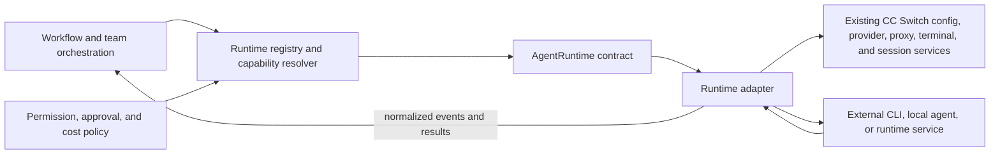
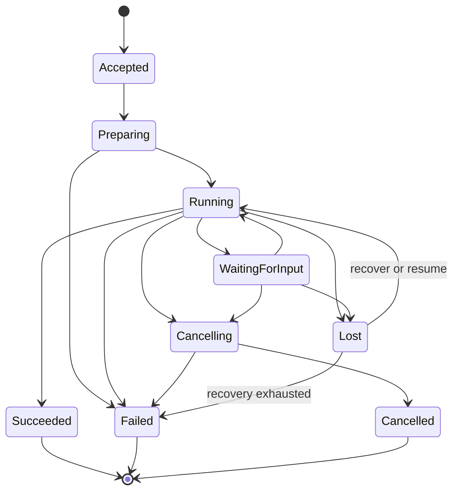

# Agent Runtime Boundary

- **Status:** Proposed
- **Owner:** Staff Architect
- **Created:** 2026-08-16
- **Last updated:** 2026-08-16
- **Generated by:** Codex, acting as Staff Architect
- **Command:** COD-003 Agent Runtime Boundary Design
- **Approvers:** Architecture owner and repository maintainer
- **Related:** [Agent OS blueprint](../agent-os-blueprint.md), [current-state architecture](./current-state.md), [agent operation guidelines](../development/agent-operation-guidelines.md)

## Purpose

This document defines the proposed architecture contract between CC Switch Agent
OS and an external or local agent runtime. The contract gives orchestration a
stable way to discover capabilities, start and observe executions, enforce
permissions, and collect results without depending on a particular CLI, model
provider, or session format.

The boundary applies to Claude Code, Codex CLI, Gemini CLI, OpenCode, and future
local-model agents. It preserves the existing CC Switch provider, proxy, native
configuration, terminal, and session-management behavior.

This is a language-neutral contract. It does not select Rust traits, IPC schemas,
database tables, plugin packaging, process libraries, or React components. Its
decisions remain proposed until accepted through architecture review and the ADR
process.

## Evidence and design context

The design is based on the following verified sources:

- GitHub `LoftySeas/cc-switch` `main` at
  `089ab6088fc983a79eceb20a17fab6bd307bd58f` for the Codex Collaboration
  Protocol and COD-003 command;
- the Agent OS blueprint, which requires a runtime-first, role-independent,
  workflow-driven, cost-aware, and human-controlled system;
- the current-state audit at local commit
  `30d779ec687cf8ecca1af7ee17bb0b986018917f`; and
- the current implementation seams documented by that audit: provider services,
  native configuration modules, terminal launch, session readers, proxy provider
  adapters, usage telemetry, and Tauri command/event boundaries.

The current-state audit found no first-class agent identity, runtime lifecycle,
workflow execution protocol, or permission grant. It also found that runtime
capability knowledge is distributed across the Rust `AppType`, frontend `AppId`,
capability lists, session dispatch, provider forms, and native configuration
modules. This contract addresses that boundary without replacing those working
components.

## Scope and non-goals

The boundary defines:

- runtime identity and discovery;
- capability declaration and negotiation;
- execution lifecycle and state;
- normalized request, event, and result envelopes;
- structured errors and recovery signals;
- permission grants and approval escalation;
- Agent Profile bindings; and
- an extension model that keeps core orchestration runtime-neutral.

The boundary does not define:

- team, role catalog, or workflow authoring schemas;
- prompt wording or model-selection policy;
- a universal model-provider HTTP protocol;
- storage, transport, serialization, or plugin ABI;
- a mandatory sandbox technology;
- a marketplace or remote runtime distribution mechanism; or
- changes to existing provider switching, proxying, or native configuration.

## Architectural boundary

The Agent Runtime boundary sits between workflow orchestration and
runtime-specific integration. Core orchestration owns intent and policy. A
runtime adapter owns translation into one runtime's native lifecycle and output.



The boundary follows these rules:

1. Core orchestration depends only on the contract and normalized domain types.
2. Runtime adapters may depend on runtime-specific modules; core orchestration
   must not.
3. A runtime adapter must not decide organizational role, workflow order, approval
   policy, or model-routing policy.
4. Provider credentials and model selection are bindings supplied to execution,
   not the identity of the runtime or agent.
5. The existing proxy `ProviderAdapter` remains an upstream model-protocol
   adapter. It is not an `AgentRuntime` and must not inherit agent lifecycle or
   permission responsibilities.
6. Capability absence must be explicit and normal. Orchestration must not emulate
   unsupported behavior by making unsafe assumptions.

## Domain vocabulary and identity

| Concept         | Meaning                                                                              | Identity and lifecycle                                                                  |
| --------------- | ------------------------------------------------------------------------------------ | --------------------------------------------------------------------------------------- |
| Runtime         | An executable agent environment, such as Codex CLI or Claude Code                    | Identified by a stable runtime type and a discovered installation or endpoint           |
| Runtime adapter | The CC Switch integration that implements this contract for one runtime family       | Versioned independently from runtime installations; owns native translation             |
| Provider        | A credentialed model-service endpoint or account configuration                       | Existing CC Switch provider identity; may be rebound without changing agent identity    |
| Model           | A selectable inference model exposed through a provider or local runtime             | Version or catalog entry; not an agent, role, or runtime                                |
| Agent Profile   | A stable user-defined agent identity plus runtime and policy bindings                | Persists across executions and may change provider, model, or role assignment           |
| Role            | A workflow responsibility such as Architect, Developer, or Reviewer                  | Assigned by a team or workflow for a task; never inferred from runtime or model         |
| Execution       | One tracked attempt to perform a task through a runtime                              | Has a globally unique ID, state history, permission grant, events, and terminal outcome |
| Native session  | A runtime-owned conversation or resume handle                                        | Opaque to orchestration except through normalized references and declared capabilities  |
| Capability      | A versioned statement of behavior the adapter can provide in its current environment | Negotiated at runtime; not a guarantee that policy permits its use                      |

IDs from different rows must never be reused as substitutes for one another.
Renaming an agent, switching a provider, selecting another model, or assigning a
new role must not silently create a new agent identity.

## Proposed `AgentRuntime` abstraction

`AgentRuntime` is a control and observation contract, not a shared implementation.
Every adapter must provide the following conceptual responsibilities.

### Runtime description and availability

An adapter must be able to:

- identify its runtime type and adapter contract version;
- report discovered installations or endpoints;
- report runtime version when detectable;
- declare current capabilities and configuration prerequisites;
- distinguish unavailable, installed-but-unconfigured, ready, and degraded states;
  and
- provide non-secret diagnostics suitable for a human operator.

Discovery must not mutate runtime configuration. A runtime may expose multiple
installations or endpoints, each with its own availability and capabilities.

### Lifecycle operations

The contract defines these conceptual operations:

| Operation     | Contract responsibility                                                                             |
| ------------- | --------------------------------------------------------------------------------------------------- |
| Describe      | Return runtime identity, contract version, and static capability vocabulary                         |
| Probe         | Inspect availability, version, configuration readiness, and effective capabilities without mutation |
| Prepare       | Validate an execution request, resolve approved bindings, and prepare isolated runtime context      |
| Start         | Accept a prepared request and return an execution handle without waiting for terminal completion    |
| Observe       | Produce normalized state and output events for an execution                                         |
| Provide input | Send structured human or workflow input when interactive input is supported and requested           |
| Checkpoint    | Request or expose a resumable point when the runtime supports it                                    |
| Resume        | Continue from an opaque native session or normalized checkpoint when supported                      |
| Cancel        | Request cooperative cancellation and report whether it was acknowledged                             |
| Terminate     | End an execution when policy authorizes forced termination                                          |
| Finalize      | Release adapter-owned temporary resources without deleting user-owned artifacts or native history   |

The exact method names and transport are implementation decisions. The observable
semantics are part of the contract.

### Execution states

All adapters normalize native behavior into this state model:



State rules:

- `Accepted` means the adapter owns the request but has not proven readiness.
- `Preparing` performs validation and setup without reporting productive runtime
  work.
- `Running` means the native runtime is actively able to produce work.
- `WaitingForInput` requires an explicit input or approval; it is not success.
- `Cancelling` distinguishes a cancellation request from confirmed cancellation.
- `Lost` means observation was interrupted and terminal state is unknown.
- `Succeeded`, `Failed`, and `Cancelled` are terminal and immutable.
- Each state change carries an execution ID, monotonically increasing sequence,
  timestamp, and causal reason.

An adapter must not report `Succeeded` only because a process exited with code
zero when required output, validation, or protocol completion is missing.

## Capability contract

Capabilities are declared by the adapter and resolved for a discovered runtime
installation. Each capability has:

- a stable name and semantic version;
- support state: `supported`, `unsupported`, `unknown`, or
  `requires-configuration`;
- constraints or limits;
- evidence source, such as runtime version, probe, or configuration; and
- optional native behavior notes that do not leak into orchestration logic.

The initial capability vocabulary should cover:

| Area          | Example capabilities                                                             |
| ------------- | -------------------------------------------------------------------------------- |
| Execution     | non-interactive task, interactive task, streaming output, structured output      |
| Session       | native session creation, resume, checkpoint, history read, safe deletion         |
| Control       | cooperative cancellation, forced termination, timeout enforcement                |
| Workspace     | read, write, patch, command execution, multiple roots                            |
| Context       | files, structured context package, prompt input, artifact references             |
| Tooling       | MCP, skills, prompts, external tools, runtime-defined tool calls                 |
| Connectivity  | direct provider access, CC Switch proxy, local-only inference, offline operation |
| Observability | token usage, monetary estimate, tool events, progress, native diagnostics        |
| Model binding | explicit provider, explicit model, runtime-selected model, local model           |
| Security      | secret references, network restriction, command restriction, approval requests   |

Capability negotiation is the intersection of:

1. what the workflow requires;
2. what the Agent Profile allows;
3. what the current adapter and runtime installation support; and
4. what the human-approved policy grant permits.

If any required capability is absent, preparation must fail with a structured
unsupported-capability error before productive execution begins. Optional
capabilities may be omitted only when the workflow declares an acceptable
fallback.

## Execution model

Executions are asynchronous, observable, and bounded. Starting an execution
returns a stable handle; completion is represented by events and a terminal
result, not by a long-lived synchronous call.

Core orchestration owns:

- execution and workflow IDs;
- task intent, role assignment, and acceptance criteria;
- selection constraints for agent, provider, and model;
- context-package references;
- permission and approval policy;
- time, token, and monetary budgets; and
- retry and checkpoint policy.

The runtime adapter owns:

- conversion to native runtime arguments, environment, and session constructs;
- native process or endpoint interaction;
- mapping native output and state into normalized events;
- redaction of runtime diagnostics;
- runtime-specific cleanup; and
- preservation of opaque native session handles when permitted.

One execution represents one attempt. A retry creates a new execution ID linked
to the previous attempt; it must not erase or rewrite the prior attempt's outcome.
Concurrency limits are capabilities and policy constraints, not assumptions made
by orchestration.

## Input contract

An execution request contains the following conceptual fields:

| Field                   | Purpose                                                                               |
| ----------------------- | ------------------------------------------------------------------------------------- |
| Contract version        | Selects the normalized request semantics                                              |
| Execution ID            | Identifies this immutable attempt                                                     |
| Agent Profile reference | Selects stable agent identity and permitted bindings                                  |
| Task specification      | States objective, constraints, deliverables, and acceptance criteria                  |
| Role context            | Describes the assigned responsibility without changing agent identity                 |
| Context package         | References governed files, prior outputs, decisions, and bounded conversation context |
| Workspace grant         | Names allowed roots and read/write modes                                              |
| Permission grant        | Defines allowed commands, tools, network, secrets, Git actions, and approval gates    |
| Runtime binding         | Selects runtime type and discovered installation or endpoint                          |
| Provider/model binding  | Selects approved provider and model, or an allowed selection policy                   |
| Budget                  | Defines time, token, cost, and retry limits                                           |
| Resume reference        | Optionally carries an opaque, adapter-owned session or checkpoint reference           |
| Correlation metadata    | Links workflow, task, parent execution, review, and audit records                     |

Requests are immutable after acceptance. New human input, approval, or policy
changes are represented as correlated control messages or a new execution, never
as silent request mutation.

Context packages contain references and bounded content, not unrestricted chat
history. Secret material is supplied through opaque secret references and must not
be embedded in task text, events, logs, or durable context packages.

## Output and event contract

Every execution emits normalized envelopes with contract version, execution ID,
sequence, timestamp, event type, and payload. Consumers must tolerate duplicate
delivery and use execution ID plus sequence for idempotent processing.

The initial event vocabulary includes:

- execution accepted, prepared, started, and state changed;
- progress or status message;
- textual output chunk;
- structured result fragment;
- artifact produced or modified;
- tool or command requested, started, and completed;
- human input or approval requested;
- checkpoint or native session reference produced;
- usage and cost observation;
- warning or degraded-capability notice;
- error observed; and
- execution completed, failed, or cancelled.

A terminal result includes:

- final state and reason;
- structured outcome and human-readable summary;
- artifact references and changed-resource manifest;
- validation evidence reported by the runtime;
- usage and cost observations with confidence/source;
- checkpoint or resume reference when available;
- warnings and recoverable limitations; and
- a sanitized terminal error when unsuccessful.

Runtime-native output may be attached as an opaque diagnostic artifact, but core
orchestration must make decisions from normalized fields. Output text is
untrusted data and must never be interpreted as an implicit permission grant or
workflow control instruction.

## Error contract

Errors are structured and stable across runtimes. Each error includes:

- error category and stable code;
- lifecycle phase;
- execution and correlation IDs when available;
- human-safe message;
- whether retry may be safe;
- whether user action or approval is required;
- whether partial output or artifacts exist;
- sanitized runtime-native code or diagnostic reference; and
- causal error reference where chaining is needed.

Required categories are:

| Category                   | Meaning                                                  | Default recovery posture                                               |
| -------------------------- | -------------------------------------------------------- | ---------------------------------------------------------------------- |
| Runtime unavailable        | Installation or endpoint cannot be found or reached      | Probe again or select another eligible runtime                         |
| Invalid configuration      | Required runtime or profile configuration is invalid     | Human correction; do not retry unchanged                               |
| Unsupported capability     | Required behavior is not provided                        | Select a compatible profile/runtime or approved fallback               |
| Permission denied          | Requested action exceeds the effective grant             | Request approval or reduce scope                                       |
| Authentication failed      | Provider or runtime authentication failed                | Refresh authorized credential; never expose secret material            |
| Preparation failed         | Workspace, context, or binding setup failed              | Correct the specific prerequisite                                      |
| Launch failed              | Native execution could not start                         | Retry only when marked safe                                            |
| Transport lost             | Observation channel failed and terminal state is unknown | Enter `Lost`; reconcile before retrying                                |
| Timeout or budget exceeded | A declared bound was reached                             | Cancel, preserve evidence, and require policy decision for more budget |
| Runtime failed             | Runtime reported a terminal failure                      | Preserve native diagnostics and partial artifacts                      |
| Output protocol violation  | Output cannot satisfy the negotiated contract            | Fail safely; do not infer success from raw text                        |
| State conflict             | Operation conflicts with current or terminal state       | Re-read state; do not repeat destructive control blindly               |
| Cancelled                  | Cancellation was confirmed                               | Terminal; retry only as a new execution                                |

Adapters must not classify an error as retryable when retrying could duplicate an
external side effect. Unknown terminal state is `Lost`, not `Failed`; reconciliation
must precede a new attempt.

## Permission contract

Permissions are deny-by-default, explicit, bounded, and auditable. The effective
grant is the intersection of workflow policy, Agent Profile limits, runtime
capabilities, workspace policy, and human approvals.

Permission dimensions include:

- workspace roots and read/write/create/delete modes;
- executable commands and argument constraints;
- process creation and termination;
- network destinations and protocols;
- secret references and permitted consumers;
- model providers and accounts;
- tools, MCP servers, skills, and external integrations;
- Git read, commit, branch, push, merge, and history-rewrite operations;
- user-interface or human-interaction requests;
- artifact publication and other external side effects; and
- time, token, cost, storage, and concurrency limits.

A runtime adapter must not broaden a grant because its native runtime lacks an
equivalent restriction. It must report the enforcement gap as a capability or
preparation failure. When enforcement is delegated to the host environment, the
grant still remains part of the execution record.

Approval requirements are explicit events. Waiting for approval transitions the
execution to `WaitingForInput`; approval produces a new bounded grant or rejects
the action. Silence, timeout, model output, or a previous approval must not be
treated as approval for a new side effect.

## Agent Profile model

An Agent Profile is the stable, user-visible identity used by teams and workflows.
It is composition, not inheritance from a runtime or model.

| Profile concern         | Contract meaning                                                                 |
| ----------------------- | -------------------------------------------------------------------------------- |
| Agent identity          | Stable ID, display name, description, ownership, and lifecycle metadata          |
| Runtime binding         | Required runtime type plus optional installation/endpoint constraints            |
| Provider binding        | Approved provider reference or provider-selection policy                         |
| Model binding           | Approved model reference, constraints, or model-selection policy                 |
| Capability requirements | Required and optional capabilities with minimum versions or limits               |
| Permission ceiling      | Maximum authority any execution of this profile may receive                      |
| Cost level              | Relative planning class plus optional budget defaults; not a role or exact price |
| Context policy          | Allowed context sources, retention, and secret-handling constraints              |
| Operational policy      | Concurrency, timeout, retry, checkpoint, and fallback limits                     |

### Separation rules

- A **runtime** determines how execution occurs.
- A **provider** determines which approved model service/account can be used.
- A **model** determines the selected inference capability and pricing context.
- An **agent identity** determines who participates in a team and owns execution
  history.
- **Capabilities** state what the current binding can do.
- **Cost level** is a routing hint or policy class derived from expected usage; it
  does not confer capability, role, or permission.

Changing provider or model does not change agent identity. Changing runtime may be
allowed only if the Agent Profile policy permits it and the replacement satisfies
all required capabilities. Historical executions retain the exact bindings they
used.

## Role separation

The invariant is:

```text
Agent != Role != Model != Runtime
```

Roles express workflow responsibility. They influence task context, expected
outputs, permissions, review gates, and acceptance criteria, but they do not select
a runtime or model by identity.

Examples:

- one Codex-backed Agent Profile may serve as Architect in a planning workflow and
  Reviewer in a change-review workflow;
- one Claude-backed Agent Profile may serve as Developer for implementation and
  Researcher for evidence collection;
- two Agent Profiles may use the same runtime and model while retaining different
  identities, permission ceilings, context policies, and cost budgets; and
- one agent identity may change model between tasks without losing team membership
  or audit continuity.

The workflow assigns a role to an agent for a bounded task. The runtime adapter
receives role context as input but must not persist it as runtime identity or infer
additional permissions from the role name.

## Runtime-family interpretation

The contract applies uniformly while allowing runtime-specific capabilities:

| Runtime family    | Boundary interpretation                                                                                                                                                     |
| ----------------- | --------------------------------------------------------------------------------------------------------------------------------------------------------------------------- |
| Claude Code       | Adapter translates normalized requests, permissions, context, native sessions, and output to Claude Code behavior; existing Claude provider/config support remains separate |
| Codex CLI         | Adapter maps execution and resume semantics to Codex CLI and normalizes its events; a Codex-backed agent may hold any workflow role                                         |
| Gemini CLI        | Adapter owns Gemini-specific launch, authentication binding, sessions, and output mapping without exposing them to orchestration                                            |
| OpenCode          | Adapter accounts for additive provider configuration and OpenCode session storage while presenting the same normalized lifecycle                                            |
| Local-model agent | Adapter may target a local CLI, process, or service; local inference does not bypass capability declaration, permission policy, budgets, or audit requirements              |

This table defines responsibility, not a claim that every listed runtime currently
implements every lifecycle or capability.

## Extension strategy

Future runtimes are added through adapters registered against the stable contract.
Core orchestration selects adapters through runtime descriptors and capability
negotiation, not hard-coded runtime-name branches.

A conforming adapter package provides:

1. a stable runtime type and adapter version;
2. discovery and readiness probes;
3. a capability descriptor;
4. lifecycle, control, event, result, error, and permission mappings;
5. configuration validation without exposing secrets;
6. conformance fixtures for state, cancellation, error, and output semantics; and
7. compatibility metadata for supported native runtime versions.

Adding an adapter may require registration or packaging configuration, but must
not require changes to workflow state machines, team logic, role logic, cost-policy
evaluation, or normalized execution consumers.

Contract evolution follows these rules:

- additive optional fields and capabilities may evolve within a compatible
  contract version;
- changed semantics require a new contract version;
- orchestration negotiates a mutually supported version before preparation;
- unknown optional events and capabilities are preserved or ignored safely;
- unknown required semantics fail preparation; and
- adapters may support more than one contract version during migration.

The exact in-process, subprocess, or remote-plugin loading mechanism is deferred.
It must not alter the logical contract.

## Compatibility with current CC Switch

The migration is additive:

- existing `ProviderService` and provider DAOs remain authoritative for provider
  management;
- native configuration modules remain authoritative for safe format translation
  and round trips;
- current terminal launch may become one adapter capability rather than being
  replaced;
- session provider modules may supply discovery and resume capabilities behind
  adapters;
- proxy provider adapters remain focused on model HTTP protocols;
- existing proxy routing, failover, streaming, and usage behavior remains
  unchanged; and
- current Tauri commands remain compatible until a separately approved IPC
  contract migration occurs.

The first migration slice should wrap read-only discovery and capability probing.
Launch, mutation, resume, and orchestration follow only after conformance and
permission contracts are validated. No existing client should be forced through
the new boundary before its adapter reaches compatibility parity.

## Proposed decisions

COD-003 proposes the following decisions for architecture review:

1. Introduce one capability-based `AgentRuntime` boundary above existing
   runtime-specific integration modules.
2. Use asynchronous execution handles, normalized state transitions, events, and
   terminal results.
3. Keep runtime, provider, model, agent identity, role, capabilities, and cost
   level as independent concepts.
4. Enforce deny-by-default permission grants as an intersection of workflow,
   profile, runtime, workspace, and human policy.
5. Add runtimes through versioned adapters and capability registration rather than
   runtime-specific branches in core orchestration.
6. Preserve current provider, proxy, configuration, terminal, session, and IPC
   behavior during incremental migration.

These decisions are not Accepted ADRs. Cross-cutting implementation must wait for
the appropriate architecture decision record and approval.

## Alternatives considered

### Extend `AppType` and `Provider` into Agent Runtime

Rejected as the target boundary. It is initially simple but binds agent identity,
execution lifecycle, and workflow policy to provider configuration and a closed
runtime list.

### Reuse the proxy `ProviderAdapter`

Rejected. That adapter translates model-provider HTTP protocols. Agent Runtime
must manage process/session lifecycle, permissions, context, events, and artifacts,
which are separate responsibilities.

### Standardize on one universal CLI protocol

Rejected as a prerequisite. Existing runtimes have different launch, interaction,
session, and output semantics. Requiring a universal CLI would either discard
capabilities or move runtime-specific branching into orchestration.

### Build a remote plugin ABI immediately

Deferred. Process isolation and independent deployment may become valuable, but
selecting an ABI before lifecycle and event semantics stabilize would lock in
premature transport details.

### Replace existing runtime management

Rejected. Reimplementing provider, native configuration, proxy, and session logic
would create migration risk without improving the orchestration contract.

## Risks and mitigations

| Risk                                           | Consequence                                            | Contract mitigation                                                                            |
| ---------------------------------------------- | ------------------------------------------------------ | ---------------------------------------------------------------------------------------------- |
| Lowest-common-denominator abstraction          | Valuable native capabilities disappear                 | Capability negotiation and optional versioned extensions                                       |
| Capability drift after runtime updates         | Previously valid workflows fail or behave differently  | Probe-derived capabilities, native version evidence, and pre-execution negotiation             |
| Permission mismatch                            | Native runtime performs a broader action than intended | Explicit enforcement evidence; fail preparation when a required restriction cannot be enforced |
| Lost execution observation                     | Duplicate retries or unknown external side effects     | `Lost` state, stable execution IDs, reconciliation, and non-retryable-by-default side effects  |
| Context or secret leakage                      | Sensitive data enters prompts, logs, or artifacts      | Bounded context packages, opaque secret references, and mandatory redaction                    |
| Provider/runtime conflation                    | Agent identity and audit history become unstable       | Separate IDs and immutable execution bindings                                                  |
| Cost data inconsistency                        | Routing and budgets become unreliable                  | Source/confidence metadata and policy bounds; cost level remains distinct from observed cost   |
| Central registry becomes another closed switch | Each adapter still requires core changes               | Descriptor registration, capability resolution, and orchestration conformance tests            |
| Native session incompatibility                 | Resume and handoff are falsely assumed                 | Opaque session references and explicit resume/checkpoint capabilities                          |
| Premature transport choices                    | Contract couples to Tauri, Rust, or local processes    | Language-neutral envelopes and deferred serialization/plugin decisions                         |

## Validation and acceptance criteria

Before this boundary can become approved architecture:

- an ADR must accept the terminology, identity boundaries, and extension model;
- Claude Code, Codex CLI, Gemini CLI, OpenCode, and a local-model-agent scenario
  must be mapped against the capability vocabulary;
- lifecycle conformance scenarios must cover success, failure, waiting for input,
  cancellation, timeout, lost observation, reconciliation, and resume;
- permission scenarios must prove denial, approval escalation, and enforcement-gap
  handling;
- request, event, result, and error examples must be serialized in a separate
  contract artifact without changing the semantics here;
- existing provider switching, native config, proxy, session, and usage behavior
  must have regression protection; and
- architecture review must resolve the open decisions below.

## Open decisions

The following are deliberately deferred:

- contract serialization and schema technology;
- in-process versus isolated adapter hosting;
- runtime adapter discovery and trust/signing model;
- durable event storage and delivery guarantees;
- native session and normalized checkpoint retention policy;
- secret broker and sandbox enforcement mechanisms;
- exact cost-level taxonomy and budget currency handling; and
- compatibility policy for adapter and native runtime versions.

Resolving these items requires separate ADRs or milestone-scoped design. Their
absence does not change the conceptual boundary defined here.
