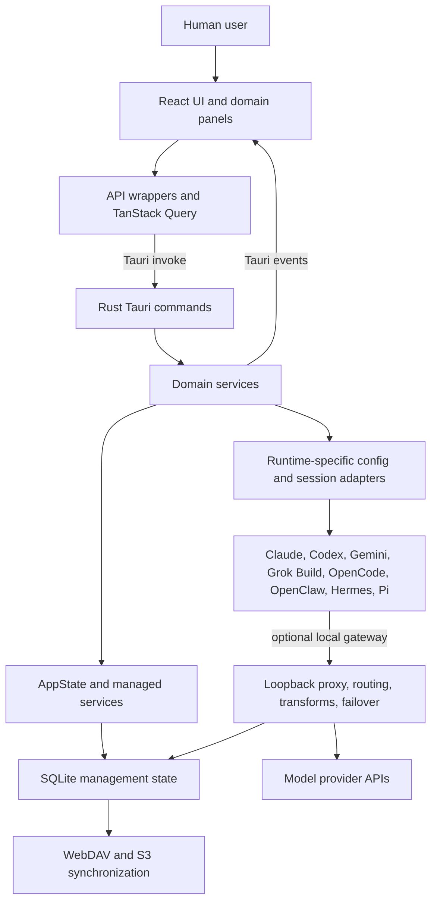
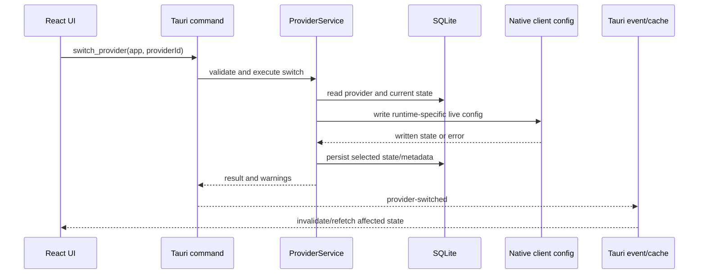

# CC Switch Current-State Architecture Audit

- **Status:** Draft
- **Owner:** Staff Architect
- **Created:** 2026-08-15
- **Last updated:** 2026-08-16
- **Generated by:** Codex, acting as Staff Architect
- **Command:** COD-002 Repository Architecture Audit
- **Related:** [Agent OS blueprint](../agent-os-blueprint.md), [documentation governance](../repository-governance.md), [agent operation guidelines](../development/agent-operation-guidelines.md)

## Purpose and scope

This document records the observed architecture of CC Switch before Agent OS
product development begins. It covers the Tauri desktop boundary, Rust backend,
React frontend, provider and runtime management, persistence, IPC, and the seams
available for a future Agent Runtime abstraction.

This is an audit, not an approved target architecture or an implementation plan.
Recommendations identify the next architecture work needed; they do not authorize
product changes.

## Audit context and evidence boundary

The audit followed the repository context-alignment protocol before source
analysis.

| Context                     | Verified value                                                                                                                                                  |
| --------------------------- | --------------------------------------------------------------------------------------------------------------------------------------------------------------- |
| Repository                  | `LoftySeas/cc-switch`; the absolute execution checkout was verified and is retained in the task delivery record rather than durable documentation               |
| Canonical remote            | `origin`, `https://github.com/LoftySeas/cc-switch.git`                                                                                                          |
| Current branch              | `agent/ccswitch-agent-usage-api`                                                                                                                                |
| Current local commit        | `5f2de1ec34b1502ca77b4f864d472ea54d2f11da`                                                                                                                      |
| Configured branch upstream  | `origin/agent/ccswitch-agent-usage-api`                                                                                                                         |
| Verified canonical baseline | Audit baseline: remote `main` at `bad5fa9d79d191e09e1adcedd3102aebbf2be00c`; delivery revalidation: remote `main` at `089ab6088fc983a79eceb20a17fab6bd307bd58f` |
| Source-of-truth model       | Verified remote `main` is the repository baseline; the checked-out task branch and workspace are overlays used to describe the code actually under review       |
| Initial workspace           | Clean; local branch was two documentation commits ahead of its configured upstream                                                                              |

The remote baseline was verified with a read-only remote query and inspected in a
separate checkout. Delivery revalidation confirmed that the mainline changes
between the audit and delivery baselines only add COD-003 and the Codex
Collaboration Protocol; no product source changed. The local clone did not contain
an `origin/main` tracking ref, so no conclusion about current mainline state was
based on a cached local ref.

Document discovery checked the local workspace, tracked task-branch files, the
verified remote-main tree, similar document titles, and available Git history.
`docs/architecture/current-state.md` was not found in those checked scopes. The
existing `docs/architecture/README.md` defines this directory as the canonical
home for current-state architecture.

### Evidence sources

The primary implementation evidence was:

- desktop composition and IPC registration: `src-tauri/src/lib.rs`,
  `src-tauri/src/main.rs`;
- application types and provider model: `src-tauri/src/app_config.rs`,
  `src-tauri/src/provider.rs`;
- backend boundaries: `src-tauri/src/commands/`, `src-tauri/src/services/`,
  `src-tauri/src/database/dao/`, and `src-tauri/src/store.rs`;
- proxy and upstream adaptation: `src-tauri/src/proxy/` and
  `src-tauri/src/services/proxy.rs`;
- native runtime integration: `src-tauri/src/*_config.rs`,
  `src-tauri/src/services/provider/`, and `src-tauri/src/session_manager/`;
- persistence: `src-tauri/src/database/mod.rs`,
  `src-tauri/src/database/schema.rs`, and `src-tauri/src/settings.rs`;
- frontend composition: `src/main.tsx`, `src/App.tsx`, `src/components/`,
  `src/lib/api/`, `src/lib/query/`, and `src/config/appConfig.tsx`;
- Agent OS surface: `src/components/agents/AgentsPanel.tsx`; and
- branch-only local usage API: `src-tauri/src/agent_api.rs` and
  `src/components/settings/AgentApiSettings.tsx`.

Static inventory found 287 Rust functions annotated as Tauri commands and 306
entries in the central `generate_handler!` registration. `AppType` is referenced
across 41 Rust files; the frontend `AppId` is referenced across 59 TypeScript or
TSX files. These counts describe the audited local commit, not an invariant.

## Executive assessment

CC Switch is a mature local desktop control plane for multiple AI coding clients
and their providers. Its strongest assets are native configuration knowledge,
provider lifecycle services, a capable local proxy with usage accounting and
failover, session discovery, and a SQLite-backed management plane.

The system is not yet an Agent OS. “Agent” behavior currently means managing or
observing external runtimes and their native files. There is no first-class domain
model for an agent identity, role, team, task, workflow, handoff, permission set,
or execution lifecycle. The Agents UI explicitly remains a placeholder.

The safest evolution path is therefore additive and contract-first: retain the
existing provider and proxy system, define a runtime boundary above its useful
seams, and migrate one capability at a time. Recasting `Provider` or `AppType`
directly as an agent abstraction would couple Agent OS semantics to existing
configuration-switching assumptions.

## Current architecture overview

CC Switch is a Tauri 2 desktop application. React owns presentation and local UI
orchestration; Rust owns privileged filesystem, database, network proxy, process,
tray, synchronization, and native-client integration. Tauri commands form the
primary request/response boundary, while Tauri events carry selected asynchronous
state changes.

The implementation is a modular monolith rather than independent deployable
services. The process boundary is the Tauri webview/Rust split; most backend
modules share one application process and one SQLite database connection owner.

## Module responsibility map

| Area                     | Primary locations                                               | Current responsibility                                                                                                                                   |
| ------------------------ | --------------------------------------------------------------- | -------------------------------------------------------------------------------------------------------------------------------------------------------- |
| Desktop bootstrap        | `src-tauri/src/main.rs`, `src-tauri/src/lib.rs`                 | Platform startup, plugin setup, database initialization and migration, tray and deep-link setup, managed state, background workers, command registration |
| Frontend bootstrap       | `src/main.tsx`                                                  | Initialization-error recovery, global providers, window activity, startup pricing synchronization, application mount                                     |
| Frontend shell           | `src/App.tsx`                                                   | Top-level navigation and view state, feature-panel composition, cross-domain UI orchestration                                                            |
| Domain UI                | `src/components/`                                               | Provider, proxy, usage, settings, sessions, skills, prompts, profiles, workspace, and integration experiences                                            |
| Frontend IPC clients     | `src/lib/api/`                                                  | Typed-by-convention wrappers around string-named Tauri invocations and event subscriptions                                                               |
| Frontend server state    | `src/lib/query/`                                                | TanStack Query reads, mutations, invalidation, and cached UI synchronization                                                                             |
| Command boundary         | `src-tauri/src/commands/`                                       | Tauri argument parsing, state access, service dispatch, event emission, and error conversion                                                             |
| Domain services          | `src-tauri/src/services/`                                       | Provider operations, live configuration, proxy lifecycle, usage, sync, MCP, skills, prompts, profiles, subscriptions, and environment operations         |
| Provider model           | `src-tauri/src/provider.rs`                                     | Provider identity, free-form runtime settings, metadata, presentation attributes, and failover participation                                             |
| Runtime classification   | `src-tauri/src/app_config.rs`                                   | Closed `AppType` set and capability decisions such as additive mode and proxy support                                                                    |
| Native integrations      | `src-tauri/src/*_config.rs`, `src-tauri/src/services/provider/` | Read, validate, merge, write, backfill, and roll back each external client's native configuration                                                        |
| Session integration      | `src-tauri/src/session_manager/`                                | Provider-specific session discovery, message loading, safe deletion, and resume metadata                                                                 |
| Proxy data plane         | `src-tauri/src/proxy/`, `src-tauri/src/services/proxy.rs`       | Local HTTP gateway, provider routing, request/response transformation, authentication, streaming, circuit breaking, failover, and telemetry              |
| Persistence              | `src-tauri/src/database/`, `src-tauri/src/database/dao/`        | SQLite schema versioning, migrations, backup, domain persistence, usage logs and rollups                                                                 |
| Device settings          | `src-tauri/src/settings.rs`                                     | Device-local settings, visible applications, directory overrides, current-provider hints, synchronization and local API settings                         |
| External synchronization | `src-tauri/src/services/webdav*`, `src-tauri/src/services/s3*`  | Backup/sync protocols, auto-sync workers, and remote archive transport                                                                                   |
| Local usage API          | `src-tauri/src/agent_api.rs` on the audited task branch         | Optional loopback-only read API over usage data; not a general Agent Runtime or workflow API                                                             |

## Frontend architecture

The frontend uses React 18, TypeScript, Vite, TanStack Query, and Tauri APIs. It is
organized by feature components with shared API, query, schema, utility, and
configuration modules.

`src/main.tsx` provides a disciplined bootstrap path: it queries backend
initialization errors before rendering, supplies global query/theme/update
providers, and treats optional pricing synchronization as non-blocking.

`src/App.tsx` is a state-driven application shell rather than a route-based shell.
It composes most major features and retains substantial navigation and domain
coordination state. This is workable for the current desktop application, but it
creates a high-coupling insertion point for future Agent OS work.

The frontend-to-backend pattern is generally:

1. a component or hook calls a function in `src/lib/api/`;
2. the wrapper invokes a string-named Tauri command;
3. a TanStack Query mutation invalidates relevant cached queries; and
4. selected backend events, such as provider switches, refresh asynchronous state.

Application support is represented by a TypeScript `AppId` union plus multiple
capability lists (`APP_IDS`, `PROXY_APP_IDS`, `ADDITIVE_APP_IDS`,
`MCP_APP_IDS`, and skill-related lists). This makes supported behavior visible,
but duplicates part of the Rust runtime registry and requires coordinated edits.

## Rust backend architecture

The Rust backend is layered in intent:

- commands expose privileged operations to the webview;
- services implement domain workflows;
- DAOs encapsulate most SQLite access;
- configuration modules encode native-client formats and locations; and
- proxy modules implement the local model-request data plane.

`src-tauri/src/lib.rs` is the composition root. It initializes storage, performs
migrations and recovery, manages services, starts background behavior, wires
plugins and tray behavior, and registers the complete IPC surface.

`AppState` holds the shared database, proxy service, and usage cache. Additional
specialized managers are registered directly with Tauri. This keeps the common
state small, although dependency ownership is split between `AppState` and the
Tauri manager registry.

The command layer often converts domain errors into `String` at the IPC boundary.
This is simple for callers, but loses stable machine-readable error categories
unless individual commands define their own response types.

## Provider and runtime management

The current core entity is `Provider`, not `Agent`. A provider contains an ID,
name, arbitrary JSON `settingsConfig`, category and metadata, display information,
and failover participation. `ProviderService` coordinates CRUD, import, switching,
native live configuration, and rollback behavior.

The closed Rust `AppType` enum and matching frontend `AppId` union identify nine
managed clients: Claude, Claude Desktop, Codex, Gemini, Grok Build, OpenCode,
OpenClaw, Hermes, and Pi.

Two integration modes are explicit:

- **Switch mode:** one selected provider is projected into a client's live
  configuration. Claude, Codex, Gemini, and Grok Build also support the local
  proxy data plane.
- **Additive mode:** multiple providers coexist in the native client
  configuration. OpenCode, OpenClaw, Hermes, and Pi use this model.

Claude Desktop has its own compatibility and route behavior. MCP, skills,
sessions, prompts, terminal launch, and provider forms have different capability
sets across clients.

Existing OpenClaw, OMO, Pi, prompt, skill, and session features manage external
runtime concepts and files. They do not establish a CC Switch-owned Agent Team or
workflow domain. `AgentsPanel.tsx` renders a “Coming Soon” state, which is direct
evidence that first-class Agent OS management is not implemented in this audited
state.

## Configuration and persistence

SQLite is the primary internal source of truth for managed records. The audited
schema is version 17 and includes providers and endpoints, MCP servers, prompts,
skills and repositories, settings, proxy configuration and health, request logs,
model pricing, stream checks, live-config backups, usage rollups, session usage
deduplication/sync state, and profiles.

The database layer performs version checks, schema migrations, pre-migration
backup, maintenance, and domain DAO operations. Database update hooks feed the
automatic WebDAV and S3 synchronization mechanisms.

Some device-specific settings are stored separately in
`~/.cc-switch/settings.json`; application-directory overrides are persisted via a
Tauri store. Legacy JSON configuration is migrated into SQLite while retaining a
migrated copy.

SQLite being authoritative does not eliminate external state. CC Switch must
project managed records into each runtime's native files, and it may read back the
actual written form. Provider switches can therefore span:

Exact ordering and rollback differ by client and operation. Architecturally, the
important property is that a logical change may touch both managed state and
unmanaged native files, so it is not a single-database transaction.

## IPC and asynchronous boundaries

The IPC surface is broad and centrally registered in `src-tauri/src/lib.rs`.
Commands cover providers, configuration, proxy, usage, authentication, MCP,
skills, prompts, profiles, sessions, synchronization, environment checks, updater
operations, workspace integration, and runtime-specific functions.

The frontend mirrors these commands in domain API modules. This organization is
easy to navigate, but command names and many payloads are manually kept in sync
between TypeScript and Rust. The audit found no single generated contract that
proves registration, wrapper name, payload, result, and error compatibility.

Tauri events are used for state that can change outside the immediate request,
including provider switching, usage updates, synchronization, proxy state, deep
links, and initialization failures. There is no general event envelope or Agent
OS execution-event protocol yet.

## Reusable components and extension seams

The following assets should be preserved and reused:

| Reusable asset                                        | Value for Agent OS                                                                  | Boundary limitation                                                              |
| ----------------------------------------------------- | ----------------------------------------------------------------------------------- | -------------------------------------------------------------------------------- |
| Native configuration modules                          | Deep knowledge of client paths, formats, validation, merge, and rollback            | Expose client-specific operations rather than one runtime lifecycle contract     |
| `ProviderService` and provider DAOs                   | Mature credential/profile switching, import, persistence, and failover integration  | Provider identity is not agent identity; settings are runtime-shaped JSON        |
| Proxy provider adapters                               | Normalize authentication, URLs, and request/response transformations for model APIs | Adapt upstream HTTP protocols, not agent execution or lifecycle                  |
| Session provider modules                              | Discover and normalize sessions from eight runtime families                         | Dispatch is a central string match with provider-specific file semantics         |
| Terminal launch support                               | Starts a selected runtime/provider in a working directory                           | Launch is not a tracked task execution with permissions, state, or handoff       |
| MCP, prompt, and skill services                       | Reusable capability assets assignable to future agents                              | Capability support is represented by scattered per-app flags and matches         |
| SQLite migration/backup layer                         | Proven durable-state foundation for new bounded entities                            | New Agent OS ownership, retention, and sync rules remain undecided               |
| Proxy telemetry and usage rollups                     | Foundation for cost visibility and policy evidence                                  | Existing accounting is provider/model request-centric, not role/workflow-centric |
| Tauri command/event bridge                            | Existing secure desktop control boundary                                            | Needs stable contracts and execution events before orchestration relies on it    |
| Loopback binding and token pattern in local usage API | Reference for narrowly scoped local integrations                                    | The branch API is read-only usage access, not an orchestration control plane     |

The proxy `ProviderAdapter` is particularly important to name correctly. It is an
upstream model-protocol adapter and should not be renamed or expanded into the
future Agent Runtime abstraction. The two abstractions have different lifecycle,
security, and failure semantics.

## Agent Runtime extension analysis

### Capabilities already present

- enumerate supported external clients;
- detect or address runtime-specific configuration locations;
- import, validate, write, and restore provider configuration;
- launch terminals with selected provider context;
- discover and read external sessions;
- project MCP servers, prompts, and skills where supported;
- proxy model requests with routing, failover, usage, and cost data; and
- persist profiles, provider metadata, and device settings.

### Missing first-class concepts

- stable agent identity independent of runtime, provider, model, and role;
- role definitions and role-to-agent assignment;
- team membership and relationship graph;
- workflow, task, step, checkpoint, and handoff state;
- runtime capability discovery through one authoritative contract;
- execution lifecycle, cancellation, timeout, retry, and recovery semantics;
- permission and approval policies per agent and workflow step;
- structured context-package ownership and retention;
- workflow-level cost budgets, attribution, and routing policy; and
- durable execution events suitable for UI recovery and audit.

### Required conceptual boundary

A future Agent Runtime boundary should sit above client-specific configuration,
session, and terminal modules. It should describe capabilities and execution
semantics without embedding provider selection, model choice, or organizational
role. Provider/model configuration remains an input to an agent profile; a role
remains an assignment made by a team or workflow.

This separation follows the Vision principle that Role and Model are independent.
It also avoids forcing all runtimes to claim capabilities—such as proxying, MCP,
or structured session deletion—that they do not support.

## Architecture disposition and alternatives

**Decision status:** This current-state audit makes no accepted target-architecture
decision. Any durable Agent Runtime boundary must be proposed and reviewed through
the ADR process.

The audit establishes one interim disposition: preserve the existing provider,
proxy, native-configuration, and session capabilities while keeping Agent,
Runtime, Provider, Model, and Role as separate concepts.

Three evolution alternatives were evaluated:

1. **Extend `Provider` and `AppType` directly into Agent OS entities.** This offers
   the shortest initial path, but couples organizational identity and workflow
   semantics to provider switching and closed runtime lists. It is not
   recommended.
2. **Replace the existing control plane with a new orchestration subsystem.** This
   provides a clean conceptual model, but duplicates mature configuration, proxy,
   session, and usage behavior and creates a high-risk migration. It is not
   recommended.
3. **Introduce an additive, capability-based Agent Runtime boundary above existing
   integrations.** This preserves proven components and supports incremental
   migration. It is the recommended subject for the next ADR, not an approved
   implementation decision in this document.

## Technical debt and architecture gaps

| Priority | Finding                                                      | Evidence and impact                                                                                                                                                                            |
| -------- | ------------------------------------------------------------ | ---------------------------------------------------------------------------------------------------------------------------------------------------------------------------------------------- |
| High     | Runtime capability knowledge is duplicated and scattered     | Rust `AppType`, frontend `AppId`, capability arrays, MCP/skill flags, session dispatch, forms, presets, and service matches must change together; a new runtime has a wide change surface      |
| High     | Provider/native-file operations cross consistency boundaries | SQLite changes and external config writes cannot share one transaction; partial failure, rollback, user edits, and concurrent runtime writes can diverge                                       |
| High     | IPC is broad, flat, and manually mirrored                    | 306 central registrations plus string-named frontend calls make contract drift and privilege review harder as orchestration expands                                                            |
| High     | No Agent OS domain or lifecycle contract exists              | Agent identity, teams, roles, tasks, workflows, permissions, and handoffs cannot be represented reliably by current provider records                                                           |
| Medium   | Composition hotspots are large                               | `services/proxy.rs` is 7,766 lines, `commands/misc.rs` 6,434, `services/skill.rs` 5,989, `services/provider/mod.rs` 4,760, `ProviderForm.tsx` 2,708, and `App.tsx` 1,829 at the audited commit |
| Medium   | Provider configuration is weakly typed at the core           | Arbitrary JSON supports heterogeneous clients, but validation and credential extraction are distributed and errors surface late                                                                |
| Medium   | IPC error contracts are inconsistent                         | Many commands reduce errors to strings, limiting stable recovery behavior and structured UI decisions                                                                                          |
| Medium   | State ownership is split                                     | Core `AppState`, separately managed Tauri services, SQLite, device JSON, plugin store, native files, and caches require explicit ownership documentation                                       |
| Medium   | Session integration uses central dispatch                    | Provider-specific modules are reusable, but adding a runtime requires edits to scan, load, delete, roots, and potentially resume handling                                                      |
| Low      | Current architecture documentation is incomplete             | Implementation knowledge is primarily encoded in source and tests, raising onboarding and migration risk                                                                                       |

Large-file counts are indicators of review and change concentration, not proof of
defects by themselves.

## Migration risks

1. **Native configuration compatibility.** Each runtime owns its schema and may
   change independently. A generic abstraction must preserve round trips,
   comments or unknown fields where applicable, authentication formats, and
   rollback behavior.
2. **Identity conflation.** Treating provider IDs, runtime IDs, model IDs, session
   IDs, and agent IDs as interchangeable would make teams and audit trails
   unstable.
3. **Dual-state divergence.** SQLite, device settings, caches, and native files can
   disagree after failure or external modification. Orchestration would amplify
   this unless ownership and reconciliation are explicit.
4. **Credential and permission expansion.** Automated agents require process,
   filesystem, network, repository, and possibly remote-write authority. Existing
   provider credentials do not define those permissions.
5. **Proxy regression.** The proxy is mature and cross-cutting. Agent Runtime work
   that changes provider routing or telemetry could affect existing switching,
   failover, streaming, and usage behavior.
6. **Session continuity.** External runtimes use different file formats and storage
   models. A workflow cannot assume uniform resume, message, delete, or archival
   guarantees.
7. **Unbounded IPC growth.** Adding one command per orchestration action without a
   domain boundary would enlarge the central registration and authorization
   surface.
8. **Cost attribution mismatch.** Current data is request/provider/model oriented.
   Role-, agent-, task-, and workflow-level budgets need stable correlation before
   cost-aware routing can be trusted.
9. **Synchronization semantics.** New execution state may be unsafe or undesirable
   to synchronize through existing WebDAV/S3 mechanisms. Data classification and
   conflict policy must precede persistence.
10. **Branch-baseline divergence.** The audited task branch contains a local Agent
    Usage API surface absent from the verified mainline tree. Architecture work
    must continue to state which layer it describes until integration resolves
    that difference.

## Recommended next architecture steps

These steps are ordered to reduce irreversible coupling before feature work.

1. **Approve terminology and ownership boundaries.** Create an ADR distinguishing
   Runtime, Provider, Model, Agent Profile, Role, Team, Workflow, Task, Session,
   and Execution, including stable identity and ownership rules.
2. **Define a runtime capability contract.** Document lifecycle operations,
   capability discovery, unsupported-capability behavior, errors, cancellation,
   security context, and observability. Keep it language-neutral at this stage.
3. **Create a runtime capability matrix.** Map every existing client against
   configuration, launch, resume, sessions, MCP, skills, prompts, proxy, usage,
   and authentication. Use unknown/not-applicable states rather than booleans
   that imply support.
4. **Decide the IPC contract strategy.** Record whether schemas will be generated,
   validated, or manually versioned; define structured errors and an execution
   event envelope before adding orchestration commands.
5. **Define Agent OS data ownership and trust boundaries.** Specify which records
   belong in SQLite, which are device-local, which may synchronize, which contain
   secrets, and which require retention or audit guarantees.
6. **Specify workflow-first execution semantics.** Define task state, transitions,
   checkpoints, approvals, retries, handoffs, context packages, and cost
   correlation without selecting a concrete Rust or React implementation.
7. **Plan an incremental migration.** Wrap one existing read-only runtime
   capability first, establish contract tests against native adapters, then add
   launch and execution behavior behind compatibility-preserving boundaries.
8. **Set architecture fitness checks.** Require capability-contract tests, IPC
   compatibility checks, native-config fixtures, migration/rollback tests,
   permission tests, and workflow cost-attribution evidence as milestone gates.

The recommended immediate follow-up is an ADR for terminology and the Agent
Runtime boundary, accompanied by the current-client capability matrix. No Agent
OS feature implementation should begin until those artifacts are reviewed.

## Audit limitations

- This was a static repository audit; no external AI runtime was launched and no
  native user configuration was mutated.
- No product test suite was run because the task changed documentation only.
- Runtime behavior inferred from code paths should be validated with contract
  tests during the next architecture milestone.
- The document is Draft and requires human architecture review before it becomes
  an approved implementation constraint.
